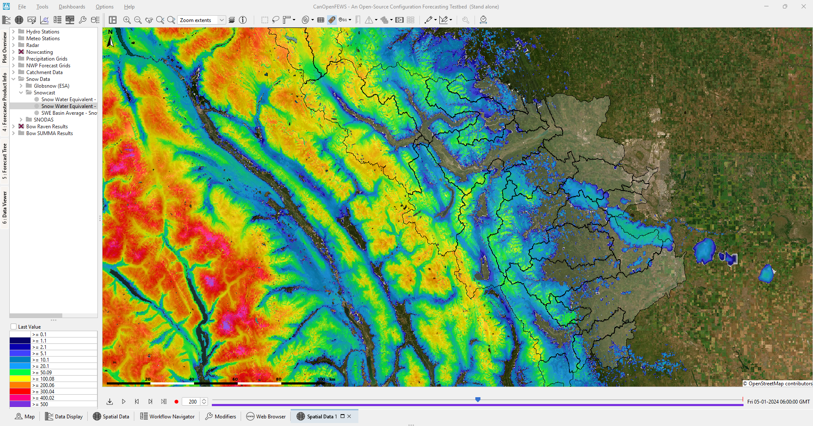

# CanOpenFEWS

CanOpenFEWS is an open and shareable configuration for an operational hydrological forecasting system with [Delft-FEWS](https://oss.deltares.nl/web/delft-fews).

This repository is meant to share developments and receive input from the forecasting community. It is experimental and demonstration only.

The technical focus is on [rainfall nowcasting](#rainfall_nowcasting) and [snow monitoring](#snow_monitoring) for operational forecasting, applied in a mountainous environment. It contains complete examples for data access, processing, visualization and application with [hydrological modelling frameworks](#hydrological_models).

The workflows allow data access and processing for a number of public data sources. Primary data sources are the [Meteorological Service of Canada Open Data](https://eccc-msc.github.io/open-data/readme_en/), but include a variety of snow and meterological re-analysis products, such as ERA5.

This repo is intended for those with some experience with the Delft-FEWS software. It is hosted on GitHub so that users can access workflows, model connections and displays for their own use. Please feel free to use the configuration to develop and improve your own applications. Also make contributions back! New data, methods, models and displays are all welcome.

## Rainfall Nowcasting

CanOpenFEWS contains a rainfall nowcasting module that uses the open source nowcasting platform [pysteps](https://pysteps.readthedocs.io/en/latest/). With nowcasting, the most recent rainfall observations are extrapolated to the future using optical flow methods (for advection) and statistical methods (for rainfall growth/dissipation estimation and post-processing purposes). The advantage of nowcasting is that it should provide more accurate rainfall forecasts for the first hours into the future than rainfall forecasts from numerical weather prediction models. Generally observations from weather radar are used for nowcasting, as weather radar provides a good spatial coverage, and high spatial and temporal resolution. This is advantageous for an observation-based forecasting technique such as nowcasting. In CanOpenFEWS, the ECCC radar product is used for nowcasting.

Pysteps contains a variety of nowcasting models and in CanOpenFEWS the models [STEPS](https://pysteps.readthedocs.io/en/latest/auto_examples/plot_steps_nowcast.html#sphx-glr-auto-examples-plot-steps-nowcast-py) and [LINDA](https://pysteps.readthedocs.io/en/latest/auto_examples/linda_nowcasts.html#sphx-glr-auto-examples-linda-nowcasts-py) are conigured. Both models can be run in a deterministic and an ensemble setup. The gif below shows an example of one ensemble member of an ensemble STEPS forecast (left) and a deterministic run with the LINDA model (right) for December 18, 2023. The LINDA model is generally regarded as the better option for convective rainfall, but it has slower run times than the STEPS model. CanOpenFEWS contains the ECCC radar imports, the nowcast model runs (the number of ensemble members can be set in the properties of the configured workflows), viewers of the radar and nwocasts data and the option to use the nowcast output as input for the hydrological model runs. At a later stage, a blending procedure can also be added to CanOpenFEWS.

## Snow Monitoring

CanOpenFEWS contains bindings to a variety of snow data products, and aims to connect measurement to modelling for snowmelt driven streamflow forecasting. The use of snow data within the system remains largely qualitative, also comparison of multiple products such as [Snowcast](http://www.snowcast.ca/), [SNODAS](https://nsidc.org/data/g02158/versions/1), [GlobSnow](https://www.globsnow.info/) and [in-situ observations](https://rivers.alberta.ca/). This suite of products will be expanded, and in consultation with end-users, methods added to connect snow measurement to model.

## Hydrological Models

CanOpenFEWS currently contains three hydrological modelling frameworks over the Bow Basin in Alberta, Canada. The three models are open source, and included to demonstrate connections to a distributed (grid-based) and semi-distributed (vector based) conceptual models, along with a more physically based modelling approach. All models contain a variety of options for discretizations, and varied process representation.

These are flexible hydrological modelling frameworks, with supporting tools for model creation, implementation and evaluation.

### wflow

[wflow](https://deltares.github.io/Wflow.jl/stable/) allows multiple distributed model concepts are available, allowing the use of open earth observation data, making it the hydrological model of choice for data scarce environments. Based on gridded topography, soil, land use and climate data, wflow calculates all hydrological fluxes at any given grid cell in the model at a given time step. Creation of wflow models is enabled by the [HydroMT](https://deltares.github.io/hydromt/latest/) python package. In CanOpenFEWS, a wflow_sbm model is included for the Bow River. The parameterization of this model is automatically derived using HydroMT, by making use of transfer functions that relate open geographic data (soil, land use, land cover, etc.) to a parameter value. The model can be further improved by calibrating its most sensitive parameters.

### SUMMA

[SUMMA](https://ral.ucar.edu/model/summa) or the Structure for Unifying Multiple Modeling Alternatives is a hydrologic modeling approach that is built on a common set of conservation equations and a common numerical solver, which together constitute the structural core of the model.

SUMMA can be used to configure a wide range of hydrological model alternatives. Different modeling approaches can then be implemented within the structural core, enabling a controlled and systematic analysis of alternative modeling options, and providing insight for future model development. SUMMA allows different model representations of physical processes and spatial configurations to be flexibly implemented and tested.
Creation of SUMMA models is enabled by the well documented [CWARHM](https://github.com/CH-Earth/CWARHM) workflow. This provides all tools necessary to build SUMMA models from scratch.

In CanOpenFEWS, a SUMMA model is implemented for the Bow River basin, using a semi-distributed Hydrological Response Unit approach to better represent the spatial distribution of snow and other variables.

### Raven

[Raven](http://raven.uwaterloo.ca/) is flexible hydrological modelling framework, allowing flexibility in spatial discretization, interpolation, process representation, and forcing function generation. In this repository, a semi-distributed HBV-EC concept model is implemented to demonstrate the model bindings and connections.

## Getting Started

If you are truly new to this software, it may be better to begin with the information [available on the Delft-FEWS website](https://oss.deltares.nl/web/delft-fews). At this link, you can find the latest information, instructions and community developments. Configuring Delft-FEWS comes with a steep learning curve, but once you are familiar with it, this repository can help to minimize reinventing the wheel by sharing configuration and it is a great way to test and share new developments (models, code, etc.).

### Installation of Delft-FEWS

Download and installation instructions are available [at this webpage, at the bottom](https://oss.deltares.nl/web/delft-fews/about-delft-fews). Delft-FEWS is free to use, but please note that a end-user license agreement is required. For further detail on obtaining Delft-FEWS, including new releases, please contact [fews-pm email](fews-pm@deltares.nl). The newest Delft-FEWS versions are only available through [fews-pm email](fews-pm@deltares.nl), but older versions can be directly downloaded from the website. This configuration has been tested with the v2023.01 of Delft-FEWS. It is possible that some functionalities do not work with other (older) versions of Delft-FEWS.

Please note that Delft-FEWS runs on Windows and Linux, and is not normally run on Mac OS.

### Using the CanOpenFEWS configuration

A complete functioning configuration is available on this GitHub repository. Complete installation instructions and where to download Python and wflow distributions are described in [/docs/InstallationInstructions.md](https://github.com/Deltares/CanOpenFEWS/blob/main/docs/InstallationInstructions.md).

If you do not plan on contributing back to the repository, it can simply be downloaded from the main page. If you do plan on contributing, which is very welcome, you will need to use git, or a program like GitHub Desktop.

### Collaborators
This collaborative configuration initiative was started by a collaboration of researchers, engineers and end-users from:
- Deltares (the Netherlands) and Deltares USA
- SWFT Response / University of Calgary via [Dave Casson](mailto:davecasson@swftresponse.ca)
- Several Canadian partners and Delft-FEWS users.

We especially would like to thank the Alberta River Forecast Center and the City of Calgary Water Resources department for feedback and contributions. Also special thanks to Rob Chlumsky of [Heron Hydrologic](https://heronhydrologic.ca/) for providing the base Raven model and description.

## License

CanOpenFEWS is licensed under an MIT license, which generally is quite open and permissive. Please see the LICENSE file for details.

## How to contribute?
Contributions to CanOpenFEWS are much appreciated. However, to ensure continuity and a stable code base, we ask you to do the following when you plan to contribute with changes, new config or new models:

*(1) Fork the repository*

*(2) Create a new branch*

All contributions should be made in a new branch under your forked repository. Working on the master branch is reserved for Core Contributors only. Core Contributors are developers that actively work and maintain the repository. They are the only ones who accept pull requests and push commits directly to the pysteps repository.For more information on how to create and work with branches, see [Branches in a Nutshell](https://git-scm.com/book/en/v2/Git-Branching-Branches-in-a-Nutshell) in the Git documentation.

*(3) Create a pull request based on the changes in your branch*

The pull requests are checked by the main contributors and merged with the main repository once accepted.

## Citations

### Delft-FEWS
Werner, M., Schellekens, J., Gijsbers, P., van Dijk, M., van den Akker, O., and Heynert, K. (2013). The Delft-FEWS flow forecasting system. *Environ Modell Softw*, 40, 65–77. doi: [10.1016/j.envsoft.2012.07.010](https://doi.org/10.1016/j.envsoft.2012.07.010).

### Nowcasting
The overall pysteps library is described in:

Pulkkinen, S., D. Nerini, A. Perez Hortal, C. Velasco-Forero, U. Germann, A. Seed, and L. Foresti (2019). Pysteps: an open-source Python library for probabilistic precipitation nowcasting (v1.0). *Geosci. Model Dev.*, 12 (10), 4185–4219, doi:[10.5194/gmd-12-4185-2019](https://doi.org/10.5194/gmd-12-4185-2019).

While the more recent blending module in pysteps is described in:

Imhoff, R.O., L. De Cruz, W. Dewettinck, C.C. Brauer, R. Uijlenhoet, K-J. van Heeringen,
C. Velasco-Forero, D. Nerini, M. Van Ginderachter, and A.H. Weerts (2023). Scale-dependent blending of ensemble rainfall nowcasts and NWP in the open-source pysteps library. *Q J R Meteorol Soc.*, 1-30, doi: [10.1002/qj.4461](https://doi.org/10.1002/qj.4461).

The STEPS method is described in:

Bowler, N.E., Pierce, C.E., and Seed, A.W. (2006). STEPS: A probabilistic precipitation forecasting scheme which merges an extrapolation nowcast with downscaled NWP. *Q J R Meteorol Soc.*, 132(620), 2127–2155, doi: [10.1256/qj.04.100](https://doi.org/10.1256/qj.04.100).

The LINDA method is described in:

Pulkkinen, S., Chandrasekar, V., and Niemi, T. (2021). Lagrangian Integro-Difference Equation Model for Precipitation Nowcasting. *J Atmos Ocean Tech*, 38(12), 2125-2145, doi: [10.1175/JTECH-D-21-0013.1](https://doi.org/10.1175/JTECH-D-21-0013.1).

### Snow data

#### Snowcast

Marsh, C.B., J.W. Pomeroy, and H.S. Wheater. The Canadian Hydrological Model (CHM) v1.0: a multi-scale, multi-extent, variable-complexity hydrological model – design and overview. Geoscientific Model Development, 13(1):225--247, 2020. doi: [10.5194/gmd-13-225-2020](https://doi.org/10.5194/gmd-13-225-2020)

#### SNODAS

National Operational Hydrologic Remote Sensing Center (2004). Snow Data Assimilation System (SNODAS) Data Products at NSIDC, Version 1 [Data Set]. Boulder, Colorado USA. National Snow and Ice Data Center. doi: [10.7265/N5TB14TC](https://doi.org/10.7265/N5TB14TC). Date Accessed 12-08-2023.

### wflow
van Verseveld, W.J., Weerts, A.H., Visser, M., Buitink, J., Imhoff, R.O., Boisgontier, H., Bouaziz, L., Eilander, D., Hegnauer, M., ten Velden, C., and Russell, B. (2022). Wflow_sbm v0.6.1, a spatially distributed hydrologic model: from global data to local applications. *Hydrol Earth Syst Sc Discussion*. doi: [10.5194/gmd-2022-182](https://doi.org/10.5194/gmd-2022-182).

### SUMMA

Clark, M. P., B. Nijssen, J. Lundquist, D. Kavetski, D. Rupp, R. Woods, E. Gutmann, A. Wood, L. Brekke, J. Arnold, D. Gochis, and R. Rasmussen, 2015a: A unified approach to process-based hydrologic modeling. Part 1: Modeling concept. Water Resources Research, 51, doi: [10.1002/2015WR017198](https://doi.org/10.1002/2015WR017198)

Clark, M. P., B. Nijssen, J. Lundquist, D. Kavetski, D. Rupp, R. Woods, E. Gutmann, A. Wood, D. Gochis, R. Rasmussen, D. Tarboton, V. Mahat, G. Flerchinger, and D. Marks, 2015b: A unified approach for process-based hydrologic modeling: Part 2. Model implementation and example applications. Water Resources Research, 51, doi: [10.1002/2015WR017200](https://doi.org/10.1002/2015WR017200)

Knoben, W. J. M., Clark, M. P., Bales, J., Bennett, A., Gharari, S., Marsh, C. B., et al. (2022). Community Workflows to Advance Reproducibility in Hydrologic Modeling: Separating model-agnostic and model-specific configuration steps in applications of large-domain hydrologic models. Water Resources Research, 58, e2021WR031753. doi: [10.1029/2021WR031753](https://doi.org/10.1029/2021WR031753)

### Raven
Craig, J.R., G. Brown, R. Chlumsky, W. Jenkinson, G. Jost, K. Lee, J. Mai, M. Serrer, M. Shafii, N. Sgro, A. Snowdon, and B.A. Tolson, Flexible watershed simulation with the Raven hydrological modelling framework, Environmental Modelling and Software, 129, 104728, July 2020 [doi:10.1016/j.envsoft.2020.104728](https://doi.org/10.1016/j.envsoft.2020.104728)
