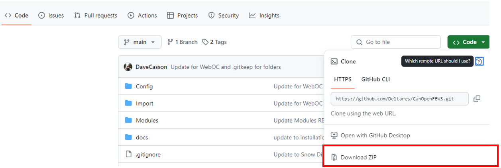
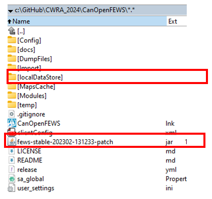

# CWRA 2024 Workshop Instructions

Thank you for participating in the CWRA 2024 Delft-FEWS User Workshop!


There is a wide range in experience between users, from brand new to expert users.
These instructions will provide a few tasks, based on your ability and interest.
Feel free to follow along with another participant. If you are beginner, ignore the optional task in the instructions.
You can always come back.


#### Get set up with CanOpenFEWS

1. Create a new directory (i.e. .\CWRA_FEWS)

2. In this new directory, create two sub-directories
  - ./CWRA_FEWS/CanOpenFEWS/
  - ./CWRA_FEWS/bin/

     


3. Go to the CanOpenFEWS GitHub [here](https://github.com/Deltares/canopenfews).

  Optional: If you are interested to contribute, and are familiar with GitHub, fork and clone the GitHub repository. Instructions for this at at the bottom of this document.

4. Download the configuration as a .zip file, unzip the contents in CWRA_FEWS/CanOpenFEWS/.

    

5. From the provided link, unzip the patch.jar into the ./CWRA_FEWS/CanOpenFEWS/ directory

    

6. Unzip the LocalDataStore.zip into the ./CWRA_FEWS/CanOpenFEWS/ directory (as above)

7. Unzip the Delft-FEWS binaries into the ./CWRA_FEWS/bin/ directory

8. Go into the ./CWRA_FEWS/bin/windows/ directory, and open create_shortcuts.exe

    

9. Once the shortcut has been created, open the CanOpenFEWS.lnk from the ./CWRA_FEWS/CanOpenFEWS/ directory

10. CanOpenFEWS should open to the landing page, you're in! Explore to see the data available.

  

## New User Tasks

1. What was the most recent discharge at the Bow River at Calgary?

  - Find this in the Data Viewer on the Right Side, Hydro and Meto Station Data
  - You will need to location and parameter, then open the Data Display

  

2. Is there snow still in the mountains?

  - Go to the Spatial Display, and check the SnowCast and SNODAS results.
  - Can you find the melt rate (under SNODAS)?

3. What was the forecasted temperature for Saskatoon?

  - In the Spatial Display, go to the NWP Forecast Grids and then the HRDPS forecast.
  - Select a variable to see the grid, and double click on the grid location to see the forecast.

  

4. Can we still go skiing and Sunshine Village?

  - Navigate to the Forecast Tree on the left side, navigate to the Snow Summary Plots.
  - Click on the Snow @ Stations
  - Find the Plot Overview and drag it to the right side of the screen
  - Open the Plot Overview toto see thumbnails of the Modelled and Measured Snow
  - Click on one of the plots to enlarge it.
  - Find Sunshine Village, decide if you want to go skiing!


5. Make the most beautiful Dashboard that you can.
  - On the top of FEWS, select the Dashboard (see image above) and create a new one and give it a unique name.
  - Then navigate to the Spatial Display, and add any active display with the Dashboard icon (or Alt+Insert)
  - This is a competition! Try to add charts, focus on a specific theme (i.e. rain or snow), or just make it beautiful!
  - Once complete, submit your user_settings.ini (in ./CWRA_FEWS/CanOpenFEWS) to Matthijs.Lemans@deltares.nl
  - We'll add the favorite one to the repository :)


## Advanced User Tasks

1. Add Python to run most import workflows

  - Access the Python311Binaries.zip here: https://zenodo.org/records/10369455
  - Download and unzip to your ./Modules folder. This will result in ./Modules/Python311
  - Once complete, run the Import Re-Analysis Precipitation --> Import HRDPA


2. Launch a WebOC

  - Ensure the the weboc zip file has been added to the Modules WebOC folder
  - Ctrl F12+M, Start TomCat WebServices
  - In a local browser, open http://localhost:8080/

      


3. Follow the instructions to contribute to the GitHub!!!

 - We can accept, you are will be a contributor to CanOpenFEWS.


4. Help others in the room :)

### Collaborating on GitHub with the Deltares/canopenfews Repository

 #### Step 1: Fork the Repository

 1. Open your web browser and go to the GitHub repository: [Deltares/canopenfews](https://github.com/Deltares/canopenfews).
 2. In the top-right corner of the page, click the **Fork** button.
    - This creates a copy of the repository in your GitHub account.


 #### Step 2: Clone the Repository

 1. After forking the repository, go to your GitHub account where the forked repository is located.
 2. Click on the **Code** button and copy the URL provided under "Clone with HTTPS" or "Clone with SSH", depending on your setup.
 3. Open your terminal (or Command Prompt on Windows).
 4. Type the following command and replace `<url>` with the URL you just copied:
    ```bash
    git clone <url>
    ```
 5. Press **Enter**. Your local clone will be created.

#### Step 3: Create a New Branch

 1. Move into the cloned directory:
    ```bash
    cd canopenfews
    ```
 2. Now, create a new branch using the `git checkout` command:
    ```bash
    git checkout -b your-new-branch-name
    ```
    Replace `your-new-branch-name` with the name you wish to give your branch.

#### Step 4: Make Changes Locally

 1. Open the project files in your preferred code editor.
 2. Make your changes to the files.
 3. Save the changes locally.

#### Step 5: Commit and Push Changes

 1. Go back to your terminal.
 2. Stage the changes for commit:
    ```bash
    git add .
    ```
 3. Commit the changes:
    ```bash
    git commit -m "Enter your commit message here"
    ```
 4. Push the changes back to your GitHub repository:
    ```bash
    git push origin your-new-branch-name
    ```

#### Step 6: Create Pull Request

 1. Go to your repository on GitHub.
 2. You'll see a `Compare & pull request` button. Click on it.
 3. You'll be taken to a page where you can create the pull request.
    - You can choose the branch that you made your changes in to compare with Deltares' main branch (usually `master` or `main`).
 4. Add a title and description for your pull request.
 5. Click on **Create pull request**.

 Congratulations! You have now forked, cloned, and proposed changes to the Deltares/canopenfews repository.

####  Requirements for your laptop
To use Delft-FEWS, you will need a computer with
  - Operating System: Windows 10 or later, Linux
  - Disk Space: At least 1 GB free to use sample data
  - Java: Java Runtime Environment (JRE) 8 or higher (search "about Java on your machine")
